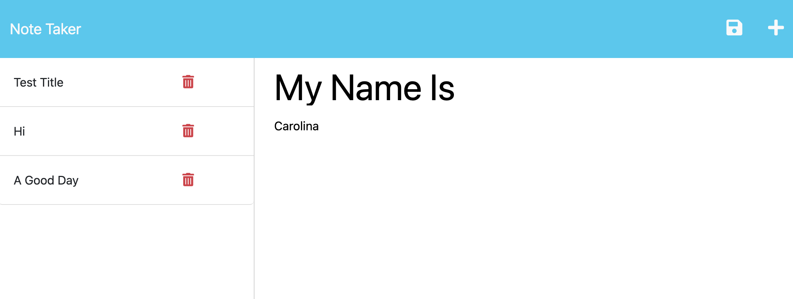

# Express--Note-Taker

## [Description:](#description)

       Note Taker is a user-friendly application that provides a streamlined way for small business owners to create, manage, and organize their notes, helping them stay productive and efficiently manage their tasks and responsibilities. The Note Taker application included a pre-built front-end interface, and the goal was to develop the back-end using Express.js to enable saving and retrieving of note data from a JSON file. After completing the back-end implementation and connecting it with the front-end, the entire application was deployed to Heroku for hosting.

       This application leverages several coding concepts and technologies to build its functionality including Express.js, JSON, HTTP requests, front-end development, CRUD operations, and deployment. It uses Express.js, a popular Node.js web framework, for handling server-side logic, including defining routes, handling HTTP requests, and managing API endpoints. JSON is used for storing and retrieving note data in a lightweight and readable format. HTTP requests, such as GET and POST, are used for sending and receiving data between the front-end and back-end, enabling users to create, read, update, and delete notes in the application. Front-end development is implemented using HTML, CSS, and JavaScript for creating the user interface and handling user interactions. CRUD operations (Create, Read, Update, Delete) are implemented to manage notes, involving handling various HTTP methods and implementing logic on the server-side using Express.js. Lastly, deployment to a hosting service like Heroku requires understanding the deployment process, configuring the application for production use, and managing dependencies, environment variables, and other deployment-related considerations. 

## [Table of Contents:](#table-of-contents:)
   
- [Description](#description)
- [Installation](#installation)
- [Usage](#usage)
- [License](#license)
- [Contributing](#contributing)
- [Tests](#tests)
- [Questions](#questions)
   
## [Installation:](#installation:)

    To use Note Taker, you will need to have the following software and tools installed:

    Node.js:
        Note Taker requires Node.js, a JavaScript runtime environment, to be installed on your local machine or server. You can download and install Node.js from the official Node.js website (https://nodejs.org/).

    Dependencies:
        Note Taker has dependencies, which are external libraries or modules required for the application to run. These dependencies are listed in the package.json file and can be installed using a package manager like npm (Node Package Manager) or yarn.

    Express.js:
        Note Taker uses Express.js as a web framework, so you need to have Express.js installed as a dependency for the application to work properly.

    Heroku:
        Note Taker is deployed to Heroku, you will need to sign up for a Heroku account and install the Heroku CLI (Command Line Interface) on your local machine to deploy and manage the application on Heroku.
   
## [Usage:](#usage:)

       The application includes a landing page with a link to a notes page. Upon clicking the link, users are presented with a page that displays existing notes in the left-hand column and provides empty fields in the right-hand column to enter a new note title and note's text.

       As users enter a new note title and note's text, a Save icon appears in the navigation at the top of the page. Clicking on the Save icon saves the new note, and it is displayed in the left-hand column along with other existing notes. Users can also click on an existing note in the list to view its details in the right-hand column. Additionally, users can click on the Write icon in the navigation to start a new note with empty fields for a new title and text. If a user wants to delete a note, they can easily do so by clicking on the red trash icon located to the right of the note they wish to delete in the left-hand column. 

       To access the Github Repository visit:
       https://github.com/CarolinaRaIs/Express-Note-Taker

       To access the deployed site visit:
       

## [License:](#license:)

       This project is licensed under the MIT License license.
   
## [Contributing:](#contributing:)

       Contributions are welcome and encouraged for this project. If you find any issues or have any suggestions for new features, please open an issue or submit a pull request. Before submitting a pull request, please ensure that your code adheres to the project's coding guidelines and has appropriate test coverage. Thank you for your interest in contributing to this project!  
   
## [Tests:](#tests:)

       We encourage contributors to thoroughly explore the code and test it to ensure its functionality. Any feedback or suggestions regarding the testing process are welcomed and appreciated.
   
## [Questions:](#questions:)

       If you have any questions about the repo you can open an issue.

**If more questions arise you can also contact CarolinaRaIs at determination28@gmail.com**
   

       
------------------------------------------------------------------------------------------------
   
This README was generated by [CarolinaRaIs](https://github.com/CarolinaRaIs)